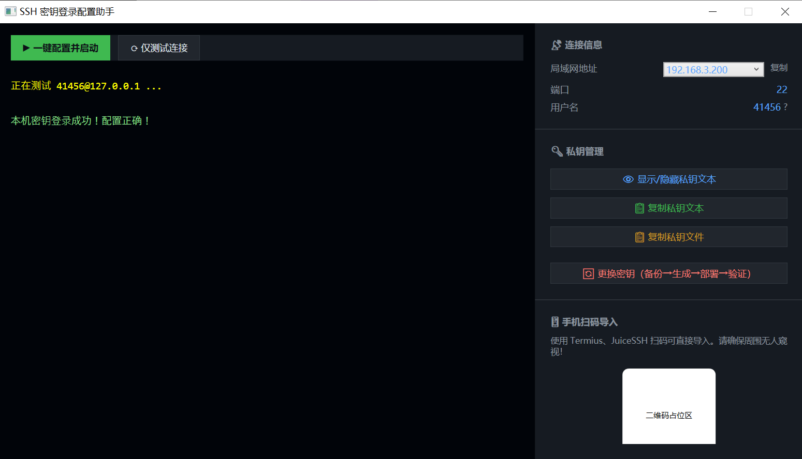

# SshHelper

Windows SSH 服务管理工具 — WPF 图形界面，用于管理 OpenSSH 服务、生成和部署 SSH 密钥。



## 功能

### 一键配置 (v1.01+)
- 自动检查并安装 OpenSSH Client/Server（通过 Windows Capability）
- 自动检测 sshd 服务状态，安装后自动启动并设为开机自启
- 缺失密钥时自动生成 ED25519 密钥对
- 自动部署公钥到 `authorized_keys` 和 `administrators_authorized_keys`
- 自动配置 ACL 权限（禁用继承、仅 SYSTEM + Administrators 可读）
- 自动测试本机密钥登录

### 密钥管理
- SSH 密钥对生成（`ssh-keygen -t ed25519`）
- 密钥备份与轮换（自动打包到 `bak/` 目录）
- 公钥自动部署（兼容 Windows OpenSSH 管理员组重定向）
- 私钥复制：文本复制 + 文件拖放复制（Win32 API，绕过管理员权限限制）

### SSH 连接测试
- 测试本机密钥登录
- 显示详细错误信息

### 智能路径查找 (v1.01+)
- 自动搜索 `ssh-keygen`/`ssh` 位置：System32 → ProgramFiles → Git for Windows → PATH
- 不再依赖系统 PATH 环境变量

### 优雅降级 (v1.01+)
- 所有 ACL 操作、文件写入、服务控制均有 try/catch 保护
- 单步失败不阻塞整体流程
- 详细的彩色日志输出

## 使用要求

- **管理员权限**：本程序需要以管理员身份运行（见 `app.manifest` 中的 `requireAdministrator`），因为它需要管理 Windows 服务及写入 `C:\ProgramData\ssh\` 目录。
- **.NET 8.0** 运行时（self-contained 发布版本无需安装）。
- OpenSSH Client/Server 可由程序自动安装，无需提前准备。

## 故障排查

### 测试本机密钥登录报「退出码 255 / Connection refused」

症状：

```
本机密钥登录失败（退出码 255）
错误详情: banner exchange: Connection to UNKNOWN port -1: Connection refused
→ 请检查 sshd 服务运行状态和 sshd_config 设置
```

**这不是密钥或 `sshd_config` 的问题，而是目标机压根没有安装 OpenSSH Server**（`sshd` 服务不存在），
所以 `127.0.0.1:22` 直接就 `Connection refused`。

本程序「一键配置」里的 OpenSSH Server 安装走的是 Windows 按需功能：

```powershell
Add-WindowsCapability -Online -Name OpenSSH.Server~~~~0.0.1.0
```

这一步**依赖 Windows 更新 / FoD 源**，在**离线机器**或**精简、克隆出来的镜像（sysprep 模板、PE、LTSC 精简版）**上会失败，
sshd 从未注册，于是测试连接必然 `Connection refused`。

**解决：改用便携版 Win32-OpenSSH（不依赖 Windows 更新）：**

1. 下载 `OpenSSH-Win64-v*.msi`（[PowerShell/Win32-OpenSSH releases](https://github.com/PowerShell/Win32-OpenSSH/releases)）
2. 安装：`msiexec /i OpenSSH-Win64-*.msi /qn`
3. 设为自启并启动：`sc config sshd start= auto` 然后 `net start sshd`

装完再回本程序点「一键配置并启动」，即可正常测试并部署密钥。

> 速查：SSH 连不上，先确认服务在不在 —— `sc query sshd`。服务都没有，就别再查密钥了。

## 免责声明

> 本软件按「原样」提供，不提供任何明示或暗示的保证，包括但不限于适销性、特定用途适用性和非侵权性的保证。在任何情况下，作者均不对因使用本软件而产生的任何索赔、损害或其他责任负责。
>
> 本软件涉及对 Windows SSH 服务的底层操作（启动/停止服务、修改系统 SSH 配置、操作管理员授权密钥文件），使用者应了解相关操作的含义并自行承担风险。

## 构建

```bash
dotnet publish -c Release -r win-x64 --self-contained true -p:PublishSingleFile=true -o ./publish
```

## License

MIT
